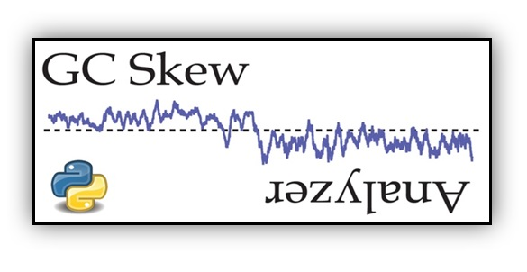
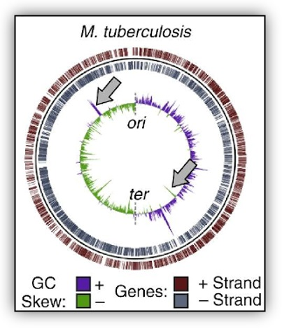
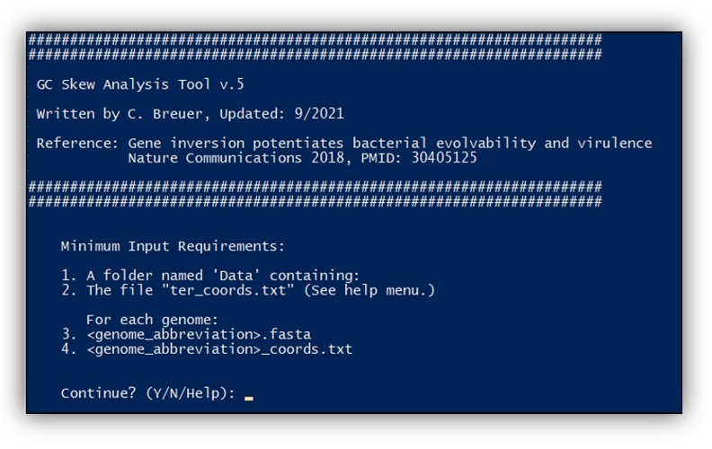

 
### Bacterial GC Skew Analyzer
- <b>Purpose:</b> calculates the GC skew of each arm of bacterial chromosomes using multiple methods 
- <b>General Concept:</b> Genes with a negative GCS (codon position 1 nucleotides) are in an atypical gene orientation (for that specific gene). This suggests they are part of a DNA fragment that was inverted by recombination at some point in the past. Genes in this position are often on the lagging strand, meaning they are transcribed in the opposing orientation to the movement of the replication fork. This can result in replication-transcription collisions, mutagenesis, replication for collapse. Lagging strand genes are often quite interesting because, in theory, they shouldn't exist - evolutionary pressure should have expunged the offending cell from the population due to major problems with DNA replication. As such, <b>these genes tend to be interesting.</b> This script helps find them. 
- <b>Method:</b> The gcs.py script uses the calculation (G-C)/(G+C) for a single strand of DNA (not <i>GC content</i> which uses both strands) for each gene on a given bacterial chromosme. The calculation uses the leading strand of the replication fork as a reference. As such, the two arms of the chromosome (either side of the replication/terminus axis) have opposing reference strands. In light of our Nature Communications 2018 paper (PMID: 30405125) the script calculates the GCS using three methods: 1) Whole-gene sequence, 2) Only nucleotides in codon position 1, 3) Nucleotides in codon position 2, 4) Nucleotides in codon position 3.   

 
<b>Diagram: </b>Depiction of the <i>M. tuberculosis</i> genome with leading/lagging strand genes on the outter ring and the leading strand GC Skew on the inner ring. The green/purple profiles show that the two arms of the chromosome have opposing GC Skew values which switch at the replication origin and terminus. The gray arrows point out two regions where the overall trend is reversed, indicating a local inversion - exactly what this program identifies on a gene-by-gene basis.

### Usage:
- The GC skew analyzer script is written in Python3 and has no dependencies.  
- To execute the program, use command: "python gcs.py" 

 

### Input Files: (3)

&emsp;1) Replication terminus model: A comma delimited file ("ter_coords.csv") with the name of each genome to be analyzed and its replication terminus (ter) location 
&emsp;2) Genome File: A fasta formatted nucleotide sequence file for the whole genome (<genomeName>.fasta) 
&emsp;3) Gene Model: For each genome, a comma delimited features file (<genomeName>_coords.csv) 

Notes: 
<i>Examples of each input file are provided in the accompanying folder, media. Users should simply copy/paste their media into the files and re-execute the script. The script is controlled by the ter_coords.csv file. It will expect to find an accompanying genome sequence and features files for each listed genome/ter. The media folder should be located the same directory as the gcs.py script.</i>

### Outputs: (6)
         
1) A media frame of the original gene annotation media plus an additional column for each of the various whole-gene GC skew values (all nucleotides, or only nucleotides in codon position 1, codon position 2, or codon position 3).
2) Wiggle file of GC skew values calculated over a Sliding window across the whole genome
3) Wiggle file by whole gene:  All nucleotides
4) Wiggle file by whole gene:  Codon position 1
5) Wiggle file by whole gene:  Codon position 2
6) Wiggle file by whole gene:  Codon position 3

### Example output visualized in [MochiView](https://www.johnsonlab.ucsf.edu/mochiview-downloads) 
- GC Skew by gene (purple)
- GC Skew by sliding window (gray)
- Hoizontal black line = GC Skew zero. (Above the line is positive, below is negative)
- Genes (pink, bottom)

 

### Notes:
For whole-gene GC skew analysis, the GC skew values are reported relative to the <i>leading strand</i> of the replication fork. This calculation requires the user to provide the location of the replication terminus (ter). Nucleotide 1 of the fasta sequence is assumed to be the origin. If you don't know what your genome's ori and ter coordinates are, they can be looked up on DoriC: http://tubic.org/doric/public/index.php  

In cases where ori is <i>not</i> the first nucleotide, or very close, the genome sequence needs to be manually rotated using software such as Clone Manager. A discussion of script function and parameter adjustment can be found at the bottom, and changed in the analyzeGCskew() function 

### Development/References:

I developed the original version of this script as part of my investigations into the evolutionary history of gene inversions:

     Gene inversion potentiates bacterial evolvability and virulence
        Christopher N Merrikh, Houra Merrikh
        Nature Communications, Nov. 2018.
        https://pubmed.ncbi.nlm.nih.gov/30405125/

I updated the script with the codon-specific calculations for a response to a matters arising paper that challenged our initial findings:  
&emsp;[Challenge](https://www.biorxiv.org/content/10.1101/2020.01.14.906818v1) 
&emsp;[Our Response](https://www.biorxiv.org/content/10.1101/2020.05.26.117366v2) 

### Discussion and Significance
Our analysis of the codon position-specific GC skew values suggests that together, the combination of the mutational signature of the replication fork plus gene inversions are sufficient to explain the vast majority of GC skew values in bacterial genomes. In particular, our results strongly suggested that the two influences are sufficient to explain the presence of negative GC skew regions. By extension, it appears that one can interpret negative GC skew values as an indication that a gene is in an atypical orientation (i.e. it is inverted relative to its typical orientation) as the result of a recombination event. This signature is best observed using the codon position 1-based GC skew which may be retained for more than 100M years post-flip as discussed in our second manuscript.

Rationale:  Codon position 3 (CP3) nucleotides are highly mutable because they can often be changed without altering the encoded amino acid. Meanwhile, CP1 nucleotides are under strong selection because mutations usually result in a change in the encoded amino acid. Therefore, we did a CP1 vs. CP3 based analysis. We hypothesized that if the  replication fork is the primary driver of the GC skew, CP3-based GC skew values should generally be positive with respect to the leading strand of the replication fork due to their general mutability. Indeed that is what our results showed. This argues against the hypothesis that sequence context and other forms of selection are major drivers of the GC skew. 

Additionally, we hypothesized that all genes are capable of gaining a positive GC skew after millions of years of evolution, irrespective of the codon position in question. This was supported by our observation that even CP1 nucleotides, which are under strong selection, show the overwhelming pattern of positive GC skew values. By extension, negative GC skew values (over whole gene regions) should be caused exclusively (more or less) by recombination events that placed these positive-GC skew genes on the opposite strand relative to their typical orientation that was retained throughout millions of years of evolutionary history. Mathematically, this inverts the GC skew value (x * -1) because it exchanges the number of Gs and Cs in the top strand. If our hypothesis is correct, then the negative GC skew values of inverted genes should be well retained in CP1 nucleotides (due to selection on protein function) and less well retained in CP3 nucleotides (which can mutate without effect). Also, CP3-based GC skew values of inverted genes should always be roughly equal or <i>higher</i> than the skew of CP1 nucleotides. This prediction is based on our fundamental assumption (supported with a variety of media) that normal DNA replication is the primary driver of the GC skew, driving it in a positive direction, even after taking into account other influences. Thus, the initially negative GC skew of inverted genes should be increasingly positive, an effect that should be far more potent in CP3 nucleotides than CP1 nucleotides. This is exactly what we observed. 

The implications of this effect are significant as it implies that nearly all bacterial genes have been encoded primarily on the leading strand of each chromosome arm throughout nearly all of evolutionary history. Furthermore, it is only through fairly recent (in evolutionary terms at least - i.e. the past 100M years) inversion events that the extant cohort of lagging strand genes were produced. It demonstrates that negative GC skew regions can be reasonably interpreted as an indication that the region is currently in an inverted configuration. 

Interestingly, we also identified evidence that in some cases periods of lagging strand encoding can accelerate the evolution of genes due to head-on replication-transcription conflicts. This could help bacteria evolve and adapt to new environments. This includes evolving new antibiotic resistance or immune evasion properties. As such, this our results have clinical relevance.  

I encourage others to test out these patterns in their species of interest. 
